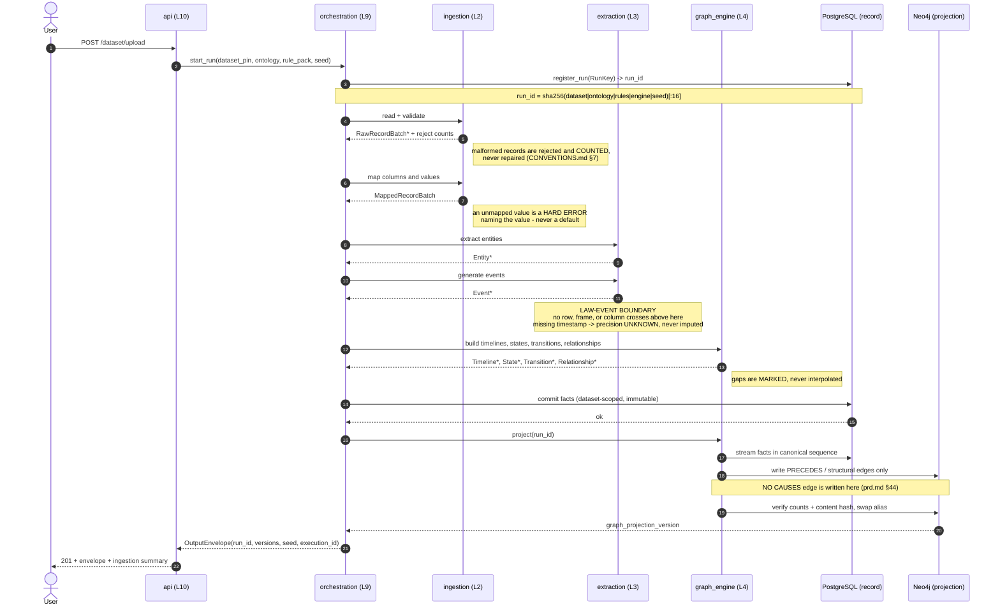
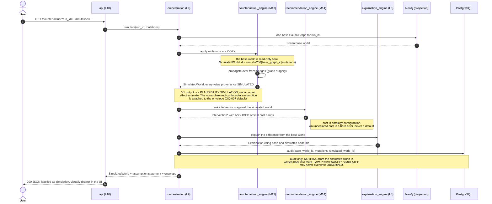

# architecture.md — Project CausaLog

> **Scope.** This document is the truth about *structure*: what the layers are, what may
> depend on what, what each module owes its neighbours, where state lives, what makes a
> conclusion reproducible, and what a new domain implements. `docs/prd.md` is the truth
> about intent. `CONTEXT.md` is the truth about current state. The code is the truth about
> what is.
>
> **Status.** The `causalog.core` interfaces are **frozen** as of 2026-08-25 (ADR-0025);
> their specification is `docs/contracts.md` v1.0.0, which is the module contract document
> OQ-009 required. Every other interface named here is still `draft`. Where this document
> adopts an Open Question's proposed default rather than a ratified decision, it says so
> inline and names the OQ.
>
> **Authority.** Where this document and `CONVENTIONS.md` disagree, `CONVENTIONS.md`
> governs *how* and this document governs *what depends on what* — and the disagreement is
> itself a defect to be filed, not reconciled by preference (`HANDOFF.md` §4).

---

## 1. Layer map and dependency rules

### 1.1 The rule, stated once

Dependencies flow in exactly one direction:

```
UI  ->  API  ->  orchestration  ->  reasoning modules  ->  core contracts
```

A package may import its own layer and every **lower** layer. It may never import a higher
one. There is no exception, no "just this once", and no configuration flag that relaxes it.
Circular imports are a defect, not a refactoring opportunity; if two packages need each
other, the shared concept belongs in `core/` (`CONVENTIONS.md` §6).

### 1.2 Layer ranks

The rank is the lint's only numeric input. It lives in machine-readable form in
`scripts/check_layers.py`; this table is its documented copy, and a divergence between them
is a defect.

| Rank | Package | Responsibility | Modules (prd.md §36) |
|---|---|---|---|
| L0 | `core` | Declare the canonical types every layer computes over | — |
| L1 | `ontology_runtime` | Load and validate an ontology instance | — |
| L2 | `ingestion` | Turn a raw dataset into validated, mapped records | 1 Data Adapter · 2 Schema Mapper |
| L3 | `extraction` | Convert mapped records into entities and events | 3 Entity Extractor · 4 Event Generator |
| L4 | `graph_engine` | Assemble observed structure into the temporal graph | 5 Timeline Builder · 6 State Engine · 7 Relationship Resolver · 8 Temporal Graph Builder |
| L5 | `rule_engine` | Load, conflict-check, and evaluate rule packs | — (mechanism, prd.md §46) |
| L6 | `causal_engine` | Produce scored causal structure | 9 Candidate Cause Generator · 10 Confidence Scorer · 11 Root Cause Analyzer · 12 Propagation Analyzer |
| L7 | `counterfactual_engine` · `recommendation_engine` | Simulate worlds; rank interventions | 13 Counterfactual Simulator · 14 Intervention Optimizer |
| L8 | `explanation_engine` | Render graph evidence into language | 15 Explanation Generator |
| L9 | `orchestration` | Compose a Run by wiring adapters into the pipeline | — |
| L10 | `api` | Expose results as structured JSON | 16 Visualization API |
| — | `persistence` | Implement L0 ports against PostgreSQL, Neo4j, Redis | — (built 2026-08-29; `docs/data-model.md`) |
| — | `frontend` | Render the six workspaces (prd.md §51) | — |

`persistence` is deliberately **not** a layer. It is a set of driven adapters implementing
ports declared in `core/ports/`, and only `orchestration` may import it (ADR-0014). This is
what keeps every reasoning package testable without a database and free of any assumption
about where its inputs were stored.

### 1.3 The two load-bearing boundaries

Both are enforced in code, not prose.

**The LAW-EVENT boundary** sits at the top of L3. A row, a DataFrame, or a column may exist
in L2 and inside `extraction/event_generator`. It may not exist above. Enforced two ways:
forbidden edge F7 blocks tabular libraries at rank ≥ 3, and `RawRecord` / `RawRecordBatch`
appear in no signature above L3.

**The inference boundary** sits between L4 and L6. Module 8 records only what was observed
and writes `PRECEDES`; module 9 is the first place an `INFERRED` assertion may be created
and the first place a `CAUSES` edge may be proposed. Enforced by forbidden edge F6.

### 1.4 Forbidden dependency edges

These are enforced by `scripts/check_layers.py` and fail the build. They are stated
explicitly here because a rule that is only implied gets argued with.

| # | Forbidden edge | Why it is forbidden |
|---|---|---|
| **F1** | `core` → any other project package | `core/` holds the canonical types and nothing else: no I/O, no database, no project-local dependency (`CONVENTIONS.md` §6). The moment `core` imports a reasoning package, the types stop being shared and start being owned. |
| **F2** | `Ln` → `Lm` where `m > n` | An upward import inverts the dependency direction and makes the pipeline a cycle. |
| **F3** | any of L4–L10 → `ontology_runtime` | **Nothing depends on the ontology except the mapping/extraction layers and the presentation layer.** L2 and L3 consume ontology semantics because mapping is their job. L9 constructs it because wiring is its job. L10 reads *labels only*, through the `PresentationLabels` port in `core`, never ontology semantics. Every other package that touches the ontology has reintroduced the domain into the reasoning core (LAW-DOMAIN, ADR-0002). |
| **F4** | any package except `orchestration` → `causalog.persistence.*` | Reasoning depends on ports, never on drivers (ADR-0014). Passing a database handle across a module boundary is a defect (`CONVENTIONS.md` §6). |
| **F5** | `api` → `graph_engine`, `causal_engine`, `counterfactual_engine`, `recommendation_engine`, `explanation_engine`, `rule_engine`, `persistence` | No cross-layer reach-through: the API layer talks to orchestration and core, never straight to a reasoning package or the graph store (`CONVENTIONS.md` §6.2). |
| **F6** | `graph_engine` → `causal_engine` | The inference boundary. Module 8 must not be able to reach for an inferred edge; if it could, "no causal inference occurs here" (prd.md §44) would hold by discipline alone. |
| **F7** | rank ≥ 3 → `pandas`, `csv`, `pyarrow`, `polars`, `numpy` | The LAW-EVENT boundary at import level. A package that cannot import a tabular library cannot hold a row. |
| **F8** | `core` → any third party except the data-validation library | `CONVENTIONS.md` §12: `core/` takes no third-party dependencies at all beyond the standard library and the chosen validation library. |
| **F9** | anything → `pgmpy`, `dowhy`, `torch`, `torch_geometric`, `sklearn`, `tensorflow` | Blocked for V1 by ADR-0003. prd.md §45 stages these at V2+; V1 intelligence comes from architecture, not model complexity. |

### 1.5 What the lint cannot catch

Honest limits, so nobody mistakes a green build for a proof:

- **Runtime injection.** A concrete adapter passed as a port satisfies F4 statically; a
  reasoning package that then branches on `isinstance` has defeated it. Covered by review,
  not by lint.
- **Domain leakage through data.** A reasoning package that branches on the *value* of an
  `event_type` string is domain-dependent while containing no banned token. LAW-DOMAIN
  catches vocabulary, not the pattern. This is the residual risk ADR-0002 accepts, and it
  is why `tests/ontology/test_ontology_swap.py` is carried as a separate obligation. That
  file does **not** exist yet -- it lands with module 2, and §8 tracks it. Until then this
  residual is disclosed and unmeasured, not covered.
- **Vocabulary in a non-scanned file type.** The lint reads `.py`, `.md`, `.sql`, and
  `.cypher` under the reasoning packages. Tracked as OQ-016.

What it *does* catch, since ADR-0019: every identifier form — `warehouse_id`, `orders`,
`WAREHOUSE_TABLE`, `customerName`, `OrderId`, `sort_order`. Until DEF-0001 it caught none
of these, only the bare English word in a comment, and this section understated the hole
by omitting it. A green LAW-DOMAIN job means no banned vocabulary is *written*; it has
never meant, and still does not mean, that the code is domain-independent.

---

## 2. Module inventory

Sixteen modules, in prd.md §36 sequence. §36 is the authoritative unit of build and
ownership; the ten prd.md §44 service names are deployment-level groupings of these
(ADR-0006, closes OQ-001).

Each entry states: a single-sentence responsibility containing no "and"; typed inputs and
outputs; the invariants it guarantees; how it fails and what it does under partial or
missing data; and what it is explicitly forbidden from doing.

---

### Module 1 — Data Adapter · `ingestion/data_adapter` · L2

- **Responsibility.** Produce validated `RawRecordBatch` values from a versioned external source.
- **Input.** `SourceReader` (port), `dataset_version: str`
- **Output.** `Iterator[RawRecordBatch]`, `IngestionSummary` (accepted count, reject count, reject reasons)
- **Invariants.** Every emitted record carries an `evidence_record_id`. Batch sequence is stable for a given `dataset_version`. The source is read, never written.
- **Failure modes.** A malformed record is **rejected, counted, and logged with a reason**; the pipeline continues and the reject count appears in the run summary and in `PROGRESS.md`. A missing source or a hash mismatch against the dataset pin is a hard error — a silently substituted dataset would invalidate every `run_id`. Partial data: an empty batch is legal; a source that yields nothing produces a summary with zero accepted, never an exception.
- **Forbidden from.** Repairing a record. Imputing a value. Emitting an `Entity` or an `Event`. Reading a second dataset in one run.

---

### Module 2 — Schema Mapper · `ingestion/schema_mapper` · L2

- **Responsibility.** Bind dataset columns and values to ontology concepts.
- **Input.** `RawRecordBatch`, `OntologySpec`, `SchemaMappingSpec`
- **Output.** `MappedRecordBatch` (records whose fields carry ontology concept names), via `apply_mapping`; plus `CoverageReport`
- **Invariants.** Every field either resolves to a declared concept or raises. `ontology_hash` is stamped on the output. The mapping is total over the columns the spec declares and explicit about the columns it drops.
- **Failure modes.** An unmapped column or value is an `OntologyMappingError` naming the value — **never a default, never a guess, never a fall-through to a catch-all** (`CONVENTIONS.md` §7). A declared-but-absent column is a hard error, because it means the dataset is not the dataset the mapping was written for. Partial data: a null in a mapped column is passed through as absent, not as a concept.
- **Forbidden from.** Inventing a concept. Emitting an `Event`. Being the last chance to catch an ontology mismatch and instead deferring it downstream. **This is the last module permitted to hold a row.**

---

### Module 3 — Entity Extractor · `extraction/entity_extractor` · L3

- **Responsibility.** Derive `Entity` values from mapped records.
- **Input.** `MappedRecordBatch`, `OntologySpec`, `SchemaMappingSpec`, `ConflictPolicy`
- **Output.** `ExtractionResult`: `tuple[Entity, ...]` sequenced by `entity_id`, `tuple[EntityHistory, ...]`, and a `ReconciliationReport`
- **Invariants.** `entity_id = digest(ENTITY, ontology_hash | entity_type | natural_key)` — content-addressed, so the same participant in two batches is one entity. Entities are immutable. `provenance_class` is `OBSERVED`.
- **Failure modes.** A record with no derivable natural key yields no entity and increments a counter; it is not an error, because a source frequently references a participant it does not describe. An identifier collision on differing payloads is a `CRITICAL` defect, never a retry (`CONVENTIONS.md` §9). Partial data: absent attributes are absent, never null-filled.
- **Forbidden from.** Deriving an `Event`. Merging two entities on a similarity heuristic — identity is content-addressed or it is not identity. Mutating an entity to reflect a later record.
- **Reconciliation (ADR-0039).** Two records agreeing about WHO and disagreeing about WHAT are resolved by a declared `ConflictPolicy` — `FIRST_WINS` (default), `LAST_WINS`, `REJECT`. The policy decides which value the entity carries and **never** whether the disagreement is reported: every conflict reaches the `ReconciliationReport` under every policy that tolerates one. Attribute history is a separate artifact keyed by `entity_id`, because the entity's content address excludes its attributes and a version carried inside would either mutate a frozen artifact or rename the participant.

---

### Module 4 — Event Generator · `extraction/event_generator` · L3

- **Responsibility.** Emit zero or more `Event` values per evidence record.
- **Input.** `MappedRecordBatch` (re-iterable: generation makes two passes), `tuple[Entity, ...]`, `OntologySpec`, `SchemaMappingSpec`, `MissingEventPolicy`
- **Output.** `GenerationResult`: `tuple[Event, ...]` sequenced by `(t_earliest, t_latest, event_id)`, and an `EventQualityReport`
- **Invariants.** Every event carries a non-empty `evidence_record_ids` and exactly one `TimeInterval`. **`provenance_class` is the one the event's ontology type declares, and no heuristic may produce an `OBSERVED` event (ADR-0041, correcting this row; ADR-0029).** Events are immutable: a correction emits a new event, never a mutation (ADR-0004). `trigger` is the proximate mechanism recorded *on* the event and is never a causal claim (OQ-012 default in use). **One occurrence is one event, however many records witness it**: records agreeing on type, participants, interval and recorded attributes corroborate one occurrence and become one event citing all of them.
- **CORRECTION, on the record rather than overwritten (ADR-0041).** The invariant above previously read `provenance_class = OBSERVED`. That was false against ADR-0029, which declares one OBSERVED event type in the DataCo pack and nineteen DERIVED ones that may never claim OBSERVED. This document predated the pack. Implementing the row as written would have put nineteen fabricated observations into the system of record with real columns standing behind them.
- **Emission (ADR-0039).** Which records witness which occurrence is DATA: one `event_emissions` rule per event type in `mapping.yaml`, a closed condition operator tree over ontology addresses plus a declared `occurred_at` policy. An emission rule names no provenance class and no participants, so neither can be got wrong there.
- **Missing events (ADR-0040).** A step a process definition expects and no field supports is, by default, **recorded as a gap and not emitted**. `EMIT_GAP_MARKER` is selectable and emits an unplaced marker with zero rule support. The active policy is stamped into the `EventQualityReport`.
- **Failure modes.** A missing timestamp yields `precision = UNKNOWN` with `provenance = ASSUMED` — **never imputed**, not to `now()`, not to epoch, not to the previous event's time (`CONVENTIONS.md` §10, ADR-0007). Imputation manufactures causality out of nothing. A day-granularity timestamp yields an interval spanning the day. An event type absent from the ontology is a hard error, and so is an event type with no `actionable` declaration (ADR-0008). Partial data: a record that describes no event legitimately emits zero events, counted in the summary.
- **Forbidden from.** Emitting a causal edge. Emitting a `State`. Collapsing an interval to a point. **Letting a row, a DataFrame, or a column cross its output boundary — this module IS the LAW-EVENT boundary.**
- **Risk note.** ADR-0004 names this the highest-risk module in the system: a row-to-events mapping error is invisible downstream and corrupts every conclusion.

---

### Module 5 — Timeline Builder · `graph_engine/timeline_builder` · L4

- **Responsibility.** Group events into per-process sequenced timelines.
- **Input.** `tuple[Event, ...]`, grouping key derived from entity participation
- **Output.** `tuple[Timeline, ...]`, each an event sequence plus explicit `gap` markers
- **Invariants.** Sequencing is by `(t_earliest, t_latest, event_id)` — total and deterministic. **Adjacency on a timeline is ordering, never causation** (`GLOSSARY.md` §2.1). Every gap is marked, never bridged.
- **Failure modes.** A missing event shows as a **gap marker**, never as an interpolated event (risk R-02); explanations built on a timeline with gaps must say so. Events with `UNKNOWN` precision are placed on the timeline but carry their unbounded interval and are excluded from adjacency reasoning. Partial data: a timeline of one event is legal.
- **Forbidden from.** Inferring the missing event. Writing an edge of any kind. Sorting by anything other than the canonical sequence key.

---

### Module 6 — State Engine · `graph_engine/state_engine` · L4

- **Responsibility.** Derive `State` and `Transition` values from events.
- **Input.** `tuple[Timeline, ...]`, `OntologySpec`
- **Output.** `tuple[State, ...]`, `tuple[Transition, ...]`
- **Invariants.** Each transition names the event it accompanies. Every state name is ontology-declared. A state holds over an interval, not an instant.
- **Failure modes.** A transition the ontology does not declare legal is a **hard error**, not a tolerated anomaly — an illegal transition means either the ontology or the event stream is wrong, and both are worth stopping for. An event that changes nothing yields no transition. Partial data: an entity whose first observed event is mid-lifecycle gets an initial state with provenance `ASSUMED`, and the assumption is recorded as an evidence record.
- **Forbidden from.** Inventing a state absent from the ontology. Inferring an unobserved intermediate state. Carrying `INFERRED` provenance — everything here is `OBSERVED` or explicitly `ASSUMED`.

---

### Module 7 — Relationship Resolver · `graph_engine/relationship_resolver` · L4

- **Responsibility.** Resolve structural `Relationship` values between entities.
- **Input.** `tuple[Entity, ...]`, `tuple[Event, ...]`, `OntologySpec`
- **Output.** `tuple[Relationship, ...]` sequenced by `relationship_id`
- **Invariants.** `relationship_type` is drawn from the structural vocabulary (prd.md §47). Each relationship is bounded by a validity interval, because structural facts are themselves temporal.
- **Failure modes.** An association implied by co-occurrence but not declared in the ontology is **not** created — co-occurrence is not structure. An ambiguous reference (two candidate targets) yields no relationship and a counted warning. Partial data: an entity with no resolvable relationship is legal and common.
- **Forbidden from.** Emitting `CAUSES`. Emitting `PRECEDES` (that is module 8's edge). Inferring a relationship from statistical association.

---

### Module 8 — Temporal Graph Builder · `graph_engine/temporal_graph_builder` · L4

- **Responsibility.** Project observed events, states, and relationships into the Temporal Property Graph.
- **Input.** `tuple[Event, ...]`, `tuple[State, ...]`, `tuple[Transition, ...]`, `tuple[Relationship, ...]`, `GraphProjection` (port)
- **Output.** `TemporalPropertyGraph` handle plus `graph_projection_version`
- **Invariants.** Writes `PRECEDES`, `BELONGS_TO`, `LOCATED_AT`, `PART_OF`, `TRANSITIONS_TO`. Every node and edge traces to a PostgreSQL fact (ADR-0001). The projection is fully rebuildable from PostgreSQL alone, and rebuilding it twice yields the same content hash.
- **Failure modes.** A graph store outage raises with the store named and the projection version requested; **a stale projection is never served as if fresh** (`ProjectionStaleError`). A write with no backing fact is a defect, detected by the rebuild hash comparison. Partial data: an event with no relationships is still projected — isolation is a finding, not an error.
- **Forbidden from.** **Writing `CAUSES`** (prd.md §44: no causal inference occurs here). Creating any node not backed by a fact. Deciding what is interesting.

---

### The Rule Engine · `rule_engine` · L5 — *mechanism, not a §36 module*

Not one of the sixteen. It is the mechanism prd.md §46 requires ("rule syntax should be
configurable; never hardcode logistics logic into source code"), and it is extension seam 4
of §5.1. Built 2026-09-01 (ADR-0044 through ADR-0047). Given a contract entry here because
module 9 depends on it and a seam with no stated contract is one every consumer guesses at.

- **Responsibility.** Evaluate a rule pack over observed facts, producing traced firings.
- **Input.** `RulePackSpec` (data, `rule_engine/<domain>/rules.yaml`), `GraphFacts`,
  and — for validation only — a `VocabularyView` from `core.ontology_view`.
- **Output.** `EvaluationResult`: `tuple[RuleFiring, ...]` sequenced by
  `(rule_id, matched_event_ids, bindings)`, a `ConflictReport`, and `EvaluationStatistics`.
- **Invariants.** **A firing that cannot explain itself cannot be constructed** — `RuleFiring`
  refuses an empty trace for a non-trivial condition, so an unexplainable firing does not
  exist to be persisted, scored or shown (ADR-0047). A pack that contradicts itself raises
  `RuleConflictError` at **load**, never at evaluation. Evaluation is deterministic and
  indexed: cost is linear in the inputs plus the output, never quadratic in the event count,
  and the bound is asserted against a returned counter rather than claimed in a comment.
  Constraints beat generators, and **every suppression is reported** rather than silently
  applied.
- **Failure modes.** A rule naming an undeclared type, role, state or attribute is an
  `ERROR` that refuses the pack, with every error reported together. A rule whose event type
  no emission rule can witness is a `WARNING` — the rule is dead data, and nothing else in
  the system would say so. A missing vocabulary makes the reference checks report
  `NOT_RUNNABLE`, never pass. Partial data: an absent attribute makes every comparison
  false, including `NOT_EQUALS` — a claim about a value nobody recorded is not supported by
  its absence, and `IS_ABSENT` is what tests for absence.
- **Forbidden from.** Creating a `CausalEdge` — module 9 owns that and the LAW-TIME gate;
  this layer stamps the verdict and stops. Assigning confidence. **Reading `Event.trigger`**
  (ADR-0020), asserted over the AST in `tests/law/`. Importing `ontology_runtime`: it is L5
  and forbidden edge F3 blocks it, which is why vocabulary arrives as a plain `core` view.
  Suppressing an `UNDETERMINED` verdict.
- **Risk note.** A valid rule pack can be a wrong rule pack, for the reason `docs/ontology.md`
  §6 gives about ontologies: nothing here checks that a claimed mechanism is real, that a
  window is the right width, or that a weight is calibrated. Tracked as risk R-16. Coverage
  is measurable and is measured; correctness is neither.

---

### Module 9 — Candidate Cause Generator · `causal_engine/candidate_cause_generator` · L6

- **Responsibility.** Propose temporally admissible `CandidateEdge` values between events.
- **Input.** `TemporalPropertyGraph`, `RulePack`, `Timeline`
- **Output.** `tuple[CandidateEdge, ...]` sequenced by `(source_event_id, target_event_id, edge_type)`
- **Invariants.** **Owns the LAW-TIME gate.** Every candidate carries a `TemporalVerdict`. `VIOLATION` candidates are never created. `UNDETERMINED` candidates are created, flagged, and **blocked from promotion to `INFERRED`**. Every candidate records the rule identifiers that proposed it.
- **Failure modes.** Day-granularity ties produce `UNDETERMINED` rather than silent loss or silent admission (**ADR-0007**). The `UNDETERMINED` count and its ratio are reported in every run summary, so a data-quality problem stays visible instead of silently shrinking the graph — and if `UNDETERMINED` dominates, that is a finding about the dataset, never something to tune away by loosening the test (`CONTEXT.md` R-14). A rule pack that contradicts itself fails at load, never at evaluation. Partial data: an event with `UNKNOWN` precision may not participate in any candidate promoted to `INFERRED`.
- **Forbidden from.** Assigning confidence. Ranking. Creating an edge whose cause interval starts at or after its effect interval ends. Discarding an `UNDETERMINED` candidate to make the graph look cleaner. **Reading `Event.trigger`** — an observed mechanism may not become an unscored causal claim (ADR-0020).

---

### Module 10 — Confidence Scorer · `causal_engine/confidence_scorer` · L6

- **Responsibility.** Decompose each candidate edge's support into named confidence components.
- **Input.** `tuple[CandidateEdge, ...]`, `TemporalPropertyGraph`, `RulePack`
- **Output.** `CausalGraph` — edges carrying `ConfidenceVector` and `EvidenceRecord` references
- **Invariants.** **Owns the LAW-EVIDENCE gate.** Every component is named, valued, provenance-classed, and traced to evidence record identifiers. Components are sequenced by `component_name`; values are quantized to six decimal places at every serialization boundary. The scalar rollup is derived and non-authoritative, and names the aggregation function that produced it (ADR-0009, closing OQ-005). Statistical association is a **named component** carrying `STATISTICAL`, never silently promoted to `INFERRED` (ADR-0003). **This is the only module permitted to write `CAUSES`.**
- **Failure modes.** An edge with no supporting component gets an explicit zero-support vector, not an empty one — an empty vector is a defect, not zero confidence. A component that cannot be traced to evidence means the module is not done (`CONVENTIONS.md` §8). Partial data: sparse history yields a low historical-support component with its evidence count stated, never a suppressed component.
- **Forbidden from.** Emitting a bare float. Merging provenance classes. Promoting an `UNDETERMINED` candidate. Overwriting an `OBSERVED` value.

---

### Module 11 — Root Cause Analyzer · `causal_engine/root_cause_analyzer` · L6

- **Responsibility.** Rank causes by impact averted, with structural earliness reported separately.
- **Input.** `CausalGraph`, `PropagationReport`, and `Event.is_actionable` — read from the event, never from the ontology (ADR-0008, forbidden edge F3)
- **Output.** `RootCauseRanking` with **two separate fields**: `earliest_cause` (structural) and `actionable_root_causes` (ranked by impact-averted × confidence, tie-broken by earliness)
- **Invariants.** The two fields are never collapsed into one number. Every ranked cause carries its `ConfidenceVector` and the evidence behind its impact estimate.
- **Failure modes.** prd.md defines root cause twice — §12 ("could prevent downstream consequences") and §29 ("would prevent the *largest* downstream impact"). Earliest and largest-impact disagree; §29's own storm → traffic → late-dispatch example says the system should distinguish both. **ADR-0008** adopts §29 for ranking and requires both fields. An event type whose `actionable` flag is mis-declared silently changes the ranking and nothing can detect it (`CONTEXT.md` R-15). A cycle in the causal graph yields a reported feedback loop, not an infinite traversal. Partial data: a chain containing a timeline gap is ranked but flagged, and the flag must survive into the explanation.
- **Forbidden from.** Creating an edge. Returning one field where two are contractually required. Ranking on the derived scalar alone.

---

### Module 12 — Propagation Analyzer · `causal_engine/propagation_analyzer` · L6

- **Responsibility.** Measure how an effect spreads through the causal graph.
- **Input.** `CausalGraph`, seed event identifier
- **Output.** `PropagationReport` — depth, breadth, duration bounds, affected-entity set, feedback loops
- **Invariants.** Depth and breadth are **separate measures**, never averaged into one figure. Durations are carried as bounds (`DurationBound`), never as point estimates. Traversal is bounded by `MAX_PROPAGATION_DEPTH`, a named constant, never a magic literal.
- **Failure modes.** A feedback loop is **a requirement, not a bug** (prd.md §31): it is detected, reported, and traversal terminates. Reaching the depth bound is reported as truncation, never as completion. Partial data: an unreachable effect yields an empty report with the reason, not a zero.
- **Forbidden from.** Creating an edge. Collapsing a duration bound for computation. Reporting a truncated traversal as exhaustive.

---

### Module 13 — Counterfactual Simulator · `counterfactual_engine` · L7

- **Responsibility.** Produce a `SimulatedWorld` by applying mutations to a copy of a frozen causal graph.
- **Input.** `CausalGraph` (base world), `tuple[Mutation, ...]`
- **Output.** `SimulatedWorld` with `provenance_class = SIMULATED` and an attached assumption statement
- **Invariants.** **Never writes to the base world.** A null intervention reproduces the base world exactly. Every simulated value carries `SIMULATED` provenance through serialization and into the UI. The output envelope carries the explicit no-unobserved-confounder assumption.
- **Failure modes.** V1 ships graph-surgery propagation over frozen edges, surfaced as a **plausibility simulation**, not a causal effect estimate — prd.md §33 promises simulation over a graph whose edges are rule- and statistics-derived rather than identified causal effects, and §16 already concedes causality is not proven (OQ-007 default; **requires ADR-0011 before this module is built**). A mutation targeting an absent node is a hard error. Partial data: a mutation on a low-confidence edge propagates, and the low confidence propagates with it.
- **Forbidden from.** Writing back to history. Presenting a simulated figure as a prediction. Dropping the assumption statement from the envelope. Estimating a causal effect it has no identification argument for.

---

### Module 14 — Intervention Optimizer · `recommendation_engine` · L7

- **Responsibility.** Rank interventions by benefit against cost.
- **Input.** `RootCauseRanking`, `PropagationReport`, `SimulatedWorld`, `CostModel`
- **Output.** `tuple[Intervention, ...]` carrying impact, cost band, expected reduction, confidence, and affected-set size (prd.md §50)
- **Invariants.** Cost is **ontology-supplied configuration, never inferred** — DataCo carries no cost data, so a computed cost would be fabricated (OQ-013 default in use). Cost bands are ordinal (`LOW`/`MEDIUM`/`HIGH`) with provenance `ASSUMED`. Every ranking input is inspectable.
- **Failure modes.** An intervention with no declared cost band is a hard error, not a default of `MEDIUM` — a fabricated cost silently drives the ranking. Partial data: a missing expected-reduction estimate yields an unranked intervention listed separately, not a zero-impact one buried at the bottom.
- **Forbidden from.** Inferring a cost. Executing an intervention (prd.md §6: the system recommends, a human decides). Mixing `ASSUMED` cost and `INFERRED` impact into one undifferentiated score.

---

### Module 15 — Explanation Generator · `explanation_engine` · L8

- **Responsibility.** Render graph evidence into natural-language explanations.
- **Input.** `RootCauseRanking`, `PropagationReport`, `SimulatedWorld`, `tuple[Intervention, ...]`, `PresentationLabels`
- **Output.** `Explanation` — sentences, each carrying the graph evidence identifiers it derives from
- **Invariants.** **Every sentence traces to graph evidence** (prd.md §52). Provenance survives into the wording: an `INFERRED` claim never reads like an `OBSERVED` one. A chain with gaps produces an explanation that states the gaps.
- **Failure modes.** Evidence insufficient for a sentence produces no sentence, never a hedged one. Partial data: an explanation over a partially `UNDETERMINED` chain says so explicitly.
- **Forbidden from.** Using an LLM in V1 — an LLM in this path breaks the sentence-by-sentence trace (`CONTEXT.md` §10). Asserting a causal claim the graph does not carry. Smoothing over a gap for readability.

---

### Module 16 — Visualization API · `api` · L10

- **Responsibility.** Serve reasoning results as structured JSON over HTTP (prd.md §53).
- **Input.** HTTP request, `orchestration` façade
- **Output.** JSON response bodies, each carrying its `OutputEnvelope`
- **Invariants.** **Every response carries the output envelope** — `run_id`, ontology version and hash, dataset version, rule pack version, engine version, projection version, seed, execution id. Provenance classes survive serialization intact. Access to any endpoint returning inferences is audited (`CONVENTIONS.md` §8).
- **Failure modes.** A requested projection version that is not the version available raises `ProjectionStaleError` rather than serving stale data as fresh. An absent run is a 404 naming the `run_id`, never an empty success. Partial data: a partially computed run returns what exists with the stage stated, never a silently truncated graph.
- **Forbidden from.** Reaching past `orchestration` into a reasoning package or the graph store (F5). Computing anything that changes a conclusion. Flattening five provenance classes into two. Returning a body without its envelope.

---

## 3. The two-database boundary

ADR-0001 is binding: **PostgreSQL is the system of record; Neo4j is a derived, fully
rebuildable projection; Redis is a cache and never a source.** This section is the exact
rule.

### 3.1 What lives where

| | **PostgreSQL** — system of record | **Neo4j** — derived projection | **Redis** — derived cache |
|---|---|---|---|
| **Holds** | Entities, events, states, transitions, relationships, evidence records, confidence vectors, the immutable append-only audit log, dataset versions, ontology versions, rule pack versions, the Run registry | Nodes and relationships per prd.md §47; the temporal graph (`PRECEDES`); the causal graph (`CAUSES`, `AMPLIFIES`, `BLOCKS`, `REDUCES`); the traversal surface for propagation, path, and cycle queries | Recomputable derived values only: rendered subgraph payloads, propagation results, ranked lists — every key scoped by `run_id`, every entry TTL'd |
| **Never holds** | Traversal results, path enumerations, anything recomputable from its own facts | **Any node or edge with no backing PostgreSQL fact** | Anything whose loss changes an answer rather than a latency |
| **Authority** | Absolute | None — derived | None — derived |
| **On loss** | Restore from backup; this is the only irreplaceable store | `make rebuild-graph` | Nothing; it refills |

The decision rule for a new piece of state, in one line: *if losing it would change an
answer, it belongs in PostgreSQL; if losing it would only change how fast an answer
arrives, it belongs in Redis; if it exists to be traversed, it is projected into Neo4j from
PostgreSQL.*

The realised schema — every table, the bi-temporal columns, the indexes with their
justifying queries, and the graph model — is `docs/data-model.md`.

### 3.2 Consistency model

1. **One authority.** Every write path lands a PostgreSQL fact first. A write to Neo4j with
   no corresponding PostgreSQL fact is a defect, not a race to be tolerated.
2. **No cross-store transaction is attempted.** No transaction spans both engines, so the
   architecture never depends on one existing. Instead the projection is *re-derivable*:
   a partial or failed projection build is discarded and rebuilt, never reconciled.
3. **Staleness is visible, never invisible.** Every graph query response carries
   `graph_projection_version`. A reader that asks for a version the store is not serving
   gets `ProjectionStaleError` — it never silently receives an older graph.
4. **Determinism is testable end to end** precisely because the graph is a function of the
   facts: same facts, same `run_id`, same projection hash.
5. **Redis is invisible to correctness.** Flushing Redis at any moment must change nothing
   but latency. A test asserts this by running a query twice with the cache cleared between.

### 3.3 Rebuild procedure

Implemented by `scripts/rebuild_graph.py` and exposed as `make rebuild-graph RUN_ID=…`.
Dropping and rebuilding the entire projection must always be safe (ADR-0001).

1. **Resolve.** Look up `run_id` in the `run` table and read its five-tuple:
   `dataset_version`, `ontology_hash`, `rule_pack_version`, `engine_version`, `seed`.
2. **Stage.** Create the projection in a **new versioned namespace**. The live namespace is
   never mutated in place, so a failed rebuild leaves the previous projection serving.
3. **Stream.** Read facts from PostgreSQL in canonical sequence, every query carrying an
   explicit `ORDER BY` on a unique key (`CONVENTIONS.md` §11):
   entities by `entity_id`; events by `(t_earliest, t_latest, event_id)`; states by
   `state_id`; transitions by `transition_id`; relationships by `relationship_id`; causal
   edges by `(source_event_id, target_event_id, edge_type)`.
4. **Verify.** Compare node and edge counts, and the projection content hash, against the
   values computed from PostgreSQL. A mismatch aborts the rebuild before any swap.
5. **Swap.** Atomically repoint the projection alias at the new namespace, then drop the
   superseded one.
6. **Assert.** For the same `run_id`, the rebuilt content hash must equal the prior build's.
   A mismatch is a **determinism defect**, not a retryable error — it means something in
   the pipeline is not a function of its inputs.

**Cost, stated plainly.** Rebuild time grows with dataset size and sits on the critical
path for the prd.md §55 target of graph generation under 60 seconds. This is a known
accepted risk (§7 below).

---

## 4. The Run model

### 4.1 Definition

A **Run** is the unit of reproducibility: the complete set of inputs that can change engine
output, condensed into one content-addressed identifier.

```
run_id = "run:" + sha256(
    dataset_version | ontology_hash | rule_pack_version | engine_version | seed
)[:16]
```

The five inputs, and why each is load-bearing:

| Input | Changes output because |
|---|---|
| `dataset_version` | Different facts, different conclusions. Pinned to the source file hash. |
| `ontology_hash` | The ontology decides what an event *is*; a different ontology is a different reading of the same bytes. |
| `rule_pack_version` | Rules generate candidate edges; editing one changes the causal graph. |
| `engine_version` | Algorithm changes change results. Bumped on any change that can alter output for identical inputs. |
| `seed` | The named seed contract. V1 is fully deterministic (ADR-0003), so the seed is currently ceremonial — and it is required anyway, so that introducing a stochastic component later cannot silently escape the fingerprint. |

### 4.2 `run_id` is not `execution_id`

`CONVENTIONS.md` §8 and §9 used one word for two things. ADR-0013 separates them:

| | `run_id` | `execution_id` |
|---|---|---|
| **Is** | The content-addressed fingerprint of the five inputs | A per-process identifier |
| **Determines** | Which artifacts exist and what they contain | Nothing |
| **Stable across reruns?** | Yes — that is the point | No, by design |
| **In determinism diffs?** | Yes | **Excluded**, explicitly, by `scripts/check_determinism.py` |
| **Appears in** | Every artifact key, every output envelope | Logs, API correlation, the audit trail |

Two executions of the same Run produce the same `run_id` and two different `execution_id`s.
That is exactly the property the determinism gate tests.

### 4.3 Scoping rule

**Every inferred artifact is scoped to a `run_id`:** candidate edges, confidence vectors,
the causal graph, root-cause rankings, propagation reports, simulated worlds, interventions,
explanations, and the graph projection.

**Observed facts are not run-scoped.** Entities, events, states, transitions, relationships,
and evidence records are scoped to `dataset_version`. This asymmetry is what makes
LAW-PROVENANCE structural rather than procedural: an inference module writes only into
run-scoped storage, so it is *incapable* of overwriting an observed fact, rather than merely
forbidden from doing so.

### 4.4 What this buys

- **Reproducible.** Anyone with the five inputs regenerates every artifact byte for byte.
  A disputed conclusion is re-derived, not re-argued.
- **Auditable.** Every audit record carries its `run_id`; from an audit record alone, a
  confidence number can be reconstructed back to the evidence that produced it
  (`CONVENTIONS.md` §8, the LAW-EVIDENCE hook).
- **Comparable.** Two runs differing in exactly one input isolate that input's effect. That
  is how "the new rule pack changed 340 edges" becomes a measurable statement.
- **Safe to change.** Editing a rule or an ontology cannot corrupt existing conclusions; it
  creates a new Run alongside them.
- **Honest about staleness.** A projection built for one `run_id` cannot be silently served
  for another, because the envelope carries both.

---

## 5. Extension seams — adding a domain without touching reasoning code

### 5.1 The six seams

A new domain implements these and nothing else. None of them lives in a reasoning package.

| # | Seam | Kind | Location |
|---|---|---|---|
| 1 | `SourceReader` | Python Protocol | declared in `core/ports/source.py`; implemented in `persistence/sources/<domain>.py` |
| 2 | `OntologySpec` | **data** | `ontology/packs/<domain>/ontology.yaml` |
| 3 | `SchemaMappingSpec` | **data** | `ontology/packs/<domain>/mapping.yaml` |
| 4 | `RulePack` | **data** | `rule_engine/<domain>/rules.yaml` |
| 5 | `CostModel` | **data** | `ontology/packs/<domain>/cost.yaml` |
| 6 | `PresentationLabels` | **data** | `ontology/packs/<domain>/labels.yaml` |

Paths moved from `ontology/<domain>/` to `ontology/packs/<domain>/` in **ADR-0027**, so that
the generated schema (`ontology/_schema/`) and the structural base pack (`_base`) are not
siblings of real domains. The seams themselves are unchanged. The full pack schema is
specified in `docs/ontology.md`; the onboarding procedure is its §4.

Five of the six are data files. Exactly one is code, and it is an adapter that reads bytes —
it contains no reasoning.

### 5.2 Worked example — a hospital domain

**The dataset.** One CSV per month of inpatient episodes. Columns: `episode_ref`,
`patient_ref`, `ward_code`, `admitted_on`, `test_ordered_at`, `result_returned_at`,
`discharge_ready_at`, `discharged_at`, `clinician_ref`.

**Step 1 — `SourceReader`: `persistence/sources/hospital.py`, ≈40 lines.** Reads the CSVs
in filename sequence, emits `RawRecordBatch` values, computes `dataset_version` from the
file hashes. It knows about files, not about medicine.

**This is the one file.** Asked "which single file changes if the domain becomes
hospitals?", the answer is that path and nothing else in the distribution. It may name
`ward_code` because `persistence/` is outside LAW-DOMAIN's scan; F4 stops any reasoning
package importing it; F7 permits its `csv` import because `persistence` has no layer rank.
Everything else a hospital needs is data — Steps 2 through 5 below.

**Step 2 — `ontology.yaml`.** A worked, loadable example of exactly this is shipped at
`ontology/packs/hospital/ontology.yaml` — the sketch below predates ADR-0026 and is kept
only as an outline of the shape. The real schema is `docs/ontology.md` §2, and a pack
declares considerably more than states and transitions: participants by role, pre- and
postconditions, process definitions, measurement operator trees, and declared actionability.

```yaml
pack_schema_version: "1.0.0"
pack_id: hospital
ontology_version: "1.0.0"
extends: _base
entity_types:
  - id: PATIENT
    identifying_keys: [patient_reference]
    lifecycle:
      states: [ARRIVED, TRIAGED, AWAITING_BED, IN_BED, UNDER_TREATMENT, DISCHARGED]
      initial_states: [ARRIVED]
      terminal_states: [DISCHARGED]
      transitions:
        - {from: ARRIVED, to: TRIAGED, triggered_by: TRIAGED}
        # ...
```

**Step 3 — `mapping.yaml`.** `episode_ref → EPISODE.natural_key`,
`test_ordered_at → TEST_REQUESTED.occurred_at (precision: MINUTE)`,
`discharge_ready_at → DISCHARGE_AUTHORIZED.occurred_at`, and so on. Any column not listed
must appear under `dropped_columns` with a reason; an unlisted column is a hard error.

**Step 4 — the rule pack.** The sketch below predates ADR-0044 and is kept only as an
outline of the shape; the real schema is `causalog.rule_engine.dsl`, normative as pydantic
models exactly as the ontology and mapping DSLs are, and a shipped example is
`rule_engine/dataco/rules.yaml`. A real rule declares considerably more than a pattern: a
rationale, an author, a knowledge provenance and its evidence basis, a weight, an explicit
temporal window with its boundary semantics as data, and a condition tree over role-bound
addresses.

```yaml
rule_pack_schema_version: "1.0.0"
rule_pack_version: "1.0.0"
rules:
  - id: R-LAB-TURNAROUND
    kind: CAUSAL
    # ... description, rationale, author, knowledge_provenance, evidence_basis,
    #     base_strength
    body:
      cause:  {binding: CAUSE,  event_type: TEST_REQUESTED}
      effect: {binding: EFFECT, event_type: DISCHARGE_AUTHORIZED}
      window: {minimum_seconds: 0, maximum_seconds: 86400}
      relation:
        direction: SHARED_PARTICIPANT
        cause_role: SUBJECT
        effect_role: SUBJECT
```

**Step 5 — `cost.yaml` and `labels.yaml`.** Ordinal cost bands per intervention kind;
display strings such as `TEST_REQUESTED → "Diagnostic test requested"`.

### 5.3 The proof: what changed, module by module

| Module | Diff to reasoning code |
|---|---|
| 1 Data Adapter | **none** — a new `SourceReader` implementation is supplied to it, not written into it |
| 2 Schema Mapper | **none** — reads `mapping.yaml` |
| 3 Entity Extractor | **none** — `entity_type` is an opaque string; no branch on its value exists |
| 4 Event Generator | **none** — reads `ontology.yaml` for event types and precision |
| 5 Timeline Builder | **none** — groups by entity participation; it has never known what an entity is |
| 6 State Engine | **none** — `legal_transitions` is data |
| 7 Relationship Resolver | **none** — relationship types are ontology data |
| 8 Temporal Graph Builder | **none** — projects typed nodes without reading their types |
| 9 Candidate Cause Generator | **none** — the rule pack is data; LAW-TIME is domain-free |
| 10 Confidence Scorer | **none** — component names are engine concepts, not domain concepts |
| 11 Root Cause Analyzer | **none** — ranks on impact and confidence |
| 12 Propagation Analyzer | **none** — graph traversal |
| 13 Counterfactual Simulator | **none** — graph surgery |
| 14 Intervention Optimizer | **none** — reads `cost.yaml` |
| 15 Explanation Generator | **none** — reads `labels.yaml` through the `PresentationLabels` port |
| 16 Visualization API | **none** — serializes typed structures with their envelope |

**Total reasoning-code diff: zero lines.** The work is one adapter and five data files.

Why this holds rather than merely being hoped for: LAW-DOMAIN's lint makes it impossible
for a reasoning package to *name* a domain concept, and forbidden edge F3 makes it
impossible for one to *read* the ontology. A future contributor cannot quietly add
`if entity_type == "PATIENT"` to the Confidence Scorer — the build fails.

**The residual hole, stated honestly.** A reasoning package could branch on the *value* of a
type string passed to it without importing the ontology and without naming a banned token.
No lint catches that. It is caught, if at all, by review and by
`tests/ontology/test_ontology_swap.py`, which asserts that swapping the ontology changes
output with no code change. This is the residual risk ADR-0002 accepts.

---

## 6. Critical-path sequence diagrams

### 6.1 Dataset ingestion to graph



### 6.2 Root-cause query

```mermaid
sequenceDiagram
    autonumber
    actor User
    participant API as api (L10)
    participant Orch as orchestration (L9)
    participant Cand as candidate_cause_generator (M9)
    participant Rules as rule_engine (L5)
    participant Conf as confidence_scorer (M10)
    participant Prop as propagation_analyzer (M12)
    participant Root as root_cause_analyzer (M11)
    participant Expl as explanation_engine (L8)
    participant Neo as Neo4j (projection)
    participant PG as PostgreSQL

    User->>API: GET /root-cause/{entity_ref}?run_id=...
    API->>Orch: root_cause(run_id, entity_ref)
    Orch->>Neo: check projection_version for run_id
    alt projection version mismatch
        Neo-->>Orch: ProjectionStaleError
        Orch-->>API: 409 naming the version requested
        Note over Orch,API: a stale projection is NEVER served as if fresh
    else projection current
        Orch->>Cand: generate candidates over the effect neighbourhood
        Cand->>Neo: traverse PRECEDES, sorted before use
        Cand->>Rules: evaluate rule pack
        Rules-->>Cand: fired rule ids
        Cand-->>Orch: CandidateEdge* + TemporalVerdict
        Note right of Cand: LAW-TIME gate<br/>VIOLATION -> never created<br/>UNDETERMINED -> kept, flagged, blocked from INFERRED

        Orch->>Conf: score candidates
        Conf->>PG: read evidence records
        Conf-->>Orch: CausalGraph with ConfidenceVector per edge
        Note right of Conf: LAW-EVIDENCE gate<br/>named components + evidence ids<br/>a bare float is a defect

        Orch->>Prop: measure spread
        Prop-->>Orch: PropagationReport (depth, breadth, duration bounds, loops)
        Orch->>Root: rank
        Root-->>Orch: earliest_cause + actionable_root_causes
        Note right of Root: TWO fields, never collapsed (OQ-003 default)

        Orch->>Expl: render
        Expl-->>Orch: Explanation, every sentence citing evidence ids
        Orch->>PG: audit(run_id, endpoint, actor, correlation_id)
        Orch-->>API: result + OutputEnvelope
        API-->>User: 200 JSON with provenance on every assertion
    end
```



### 6.3 Counterfactual query



---

## 7. Accepted architectural risks

Recorded here and in `CONTEXT.md` §9. Each names the trigger that reopens it.

| # | Risk accepted | Trigger to revisit |
|---|---|---|
| 1 | **Projection rebuild sits on the critical path.** Neo4j being a derived projection means graph availability is bounded by rebuild time, against a prd.md §55 target of under 60 seconds. | The first measured full rebuild exceeding 60s on the DataCo dataset, or any need to rebuild during a user-facing request. |
| 2 | **Recall is bounded by rule coverage, and the system cannot report what it missed.** ADR-0003 defers ML; a causal relationship not expressible as a rule is invisible, and its absence is silent. **Partially addressed 2026-09-01 (ADR-0044):** the coverage report names every declared event type no rule explains, and the `ConflictReport` names every candidate a constraint suppressed — two classes of absence that are no longer silent. The residual is unchanged and is the larger half: a mechanism nobody wrote a rule for is still invisible, and no report can name what nobody thought of. | A user-visible false-negative that matters, or the arrival of any labelled causal ground truth against which recall becomes measurable. |
| 3 | **`UNDETERMINED` may dominate the causal graph.** ADR-0007 retains temporally ambiguous edges rather than guessing; on a day-granularity dataset most candidates may be unpromotable, leaving the headline output thin. The ordering information is simply not in the data. | The first measured run where `UNDETERMINED` exceeds the promotable share — at which point the answer is a better-resolved dataset, never a looser test. |
| 4 | **A mis-declared `actionable` flag is undetectable.** ADR-0008 ranks on ontology configuration with no ground truth to validate it against. | Recurring disputes about the ranking, or any case where the flag and the intervention catalogue disagree. |
| 5 | **`core/` purity costs debuggability.** No reasoning package may name what it reasons about, so error messages and traces are abstract by construction, and the English word that collides with the banned vocabulary cannot be used even in a comment. | Sustained evidence that incident diagnosis is slowed by abstract errors — at which point the fix is richer structured context on errors, never a relaxation of LAW-DOMAIN. |

---

## 8. Document obligations

This document creates the following obligations. Each is either satisfied now or tracked.

| Obligation | Status |
|---|---|
| The layer rank table matches `scripts/check_layers.py` | satisfied; divergence is a defect |
| Forbidden edges F1–F9 are enforced, not documented only | satisfied |
| LAW-DOMAIN lint exists, fails the build, and catches identifier forms | satisfied since ADR-0019; the first implementation did not (DEF-0001) |
| Every enforcement script is observed to reject, not merely to pass | satisfied — `--self-test` on all five law scripts and on the stack preflight, run in CI before each scan |
| A rebuild command exists (ADR-0001 obligation) | **satisfied 2026-08-29.** `scripts/rebuild_graph.py` implements all six steps of §3.3 over `causalog.persistence.neo4j.projection`. `make verify-projection RUN_ID=…` additionally reports drift at any time, which is the case that matters — drift arrives after the build. Not yet exercised against a live Neo4j (`PROGRESS.md` §00d, known gaps). |
| The determinism gate runs the pipeline twice | script exists; **NOT-YET-RUNNABLE** until the pipeline exists — tracked in `PROGRESS.md` |
| `tests/ontology/test_ontology_swap.py` proves domain independence empirically | **still open.** `tests/ontology/test_pack_is_not_domain_shaped.py` (ADR-0026) discharges half of it: two unrelated domains load through one code path, share no behavioural vocabulary, and share only the structural base. That the swap changes engine *output* still needs a pipeline. |
| The domain pack schema is published and cannot drift from its validator | satisfied — generated from `causalog.ontology_runtime.dsl`, checked by `scripts/export_ontology_schema.py --check` in `make laws` and CI (ADR-0026) |
| A new domain can be onboarded by someone who did not write the ontology layer | satisfied — `docs/ontology.md` §4, a numbered checklist |
| Every interface named here appears in the `CONTEXT.md` §6 registry | satisfied |
