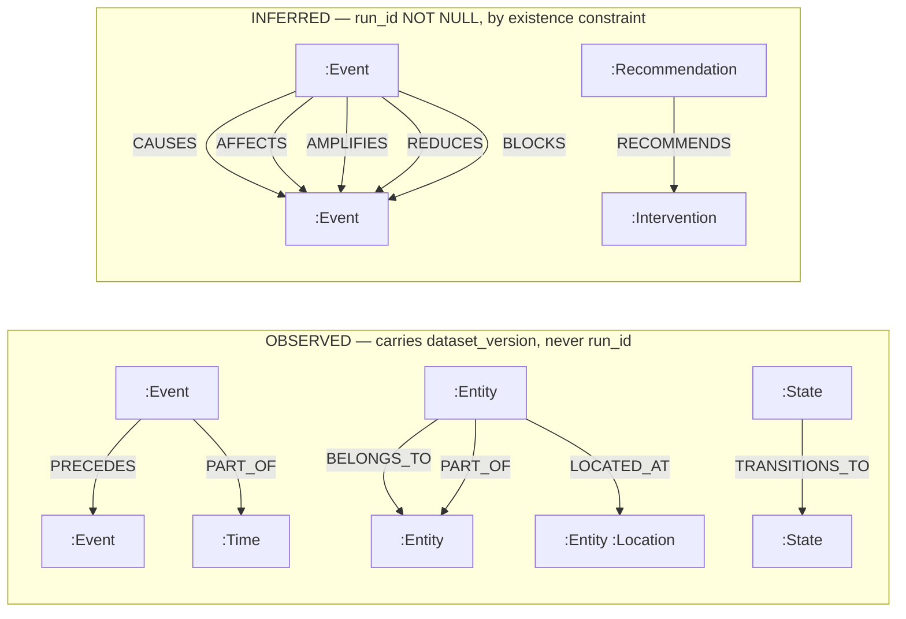

# data-model.md — the storage layer

> **Scope.** This document is the truth about *where state lives and what shape it has*:
> the PostgreSQL schema, the Neo4j projection, the mapping between the canonical types and
> the graph, and the boundary rule that governs all three. `docs/contracts.md` is the truth
> about what the types *are*; `docs/architecture.md` is the truth about what depends on
> what; this is the truth about how they are stored.
>
> **Status.** The schema is `postgres_schema_version` 1.0.0. The repository ports in
> `core/ports/persistence.py` are still `draft` — nothing consumes them yet, and freezing a
> contract nobody has built against is the error OQ-009 existed to prevent.
>
> **Authority.** ADR-0001 governs the boundary; ADR-0032 governs bi-temporality; ADR-0033
> governs migrations; ADR-0034 governs the graph projection.

---

## 1. The boundary rule, in one paragraph

**PostgreSQL is the system of record; Neo4j is a derived, fully rebuildable projection;
Redis is a cache and never a source.** Every write path lands a PostgreSQL fact first, and
a node or relationship in Neo4j with no backing PostgreSQL fact is a defect rather than a
race to be tolerated — the rebuild's verification step exists to catch exactly that. The
graph is not a second copy of the truth but a *function of* it: dropping the entire
projection and rebuilding it from PostgreSQL alone must always be safe and routine, which
is why `make rebuild-graph RUN_ID=…` is a one-line operation and why two rebuilds of one
run must produce an identical content hash. Redis holds only values that can be recomputed,
every key scoped by `run_id` and every entry carrying a TTL, so that flushing it at any
moment changes latency and never an answer. The decision rule for any new piece of state is
therefore one sentence: *if losing it would change an answer it belongs in PostgreSQL; if
losing it would only change how fast an answer arrives it belongs in Redis; if it exists to
be traversed it is projected into Neo4j from PostgreSQL.*

---

## 2. Entity–relationship diagram

Observed facts are scoped to `dataset_version`. Inferred artifacts are scoped to `run_id`,
`NOT NULL`. That asymmetry is the whole of LAW-PROVENANCE's structural enforcement: an
inference module writes only into run-scoped storage, so it is *incapable* of overwriting an
observed fact rather than merely forbidden from doing so.

```mermaid
erDiagram
    dataset_version   ||--o{ evidence_record : "pins"
    dataset_version   ||--o{ entity          : "scopes"
    dataset_version   ||--o{ event           : "scopes"
    dataset_version   ||--o{ state           : "scopes"
    dataset_version   ||--o{ relationship    : "scopes"
    ontology_version  ||--o{ entity          : "types"
    ontology_version  ||--o{ event           : "types"

    dataset_version   ||--o{ run             : "input 1"
    ontology_version  ||--o{ run             : "input 2"
    rule_pack_version ||--o{ run             : "input 3"

    entity            ||--o{ entity_attribute            : "has"
    entity            ||--o{ entity_lifecycle_state      : "declares"
    entity            ||--o{ entity_lifecycle_transition : "declares"
    entity            ||--o{ entity_evidence             : "cites"

    event             ||--o{ event_entity             : "involves"
    event             ||--o{ event_changed_attribute  : "changed"
    event             ||--o{ event_metadata           : "carries"
    event             ||--o{ event_evidence           : "cites"
    entity            ||--o{ event_entity             : "participates"
    evidence_record   ||--o{ event_evidence           : "cited by"
    evidence_record   ||--|| event                    : "source_record_ref"

    confidence_vector ||--|{ confidence_component               : "decomposes into"
    confidence_component ||--o{ confidence_component_evidence   : "traces to"
    evidence_record   ||--o{ confidence_component_evidence      : "supports"
    confidence_vector ||--|| event                              : "scores"

    event             ||--o{ state              : "derives"
    entity            ||--o{ state              : "holds"
    state             ||--o{ state_evidence     : "cites"
    event             ||--o{ state_transition   : "occasions"
    entity            ||--o{ relationship       : "source"
    entity            ||--o{ relationship       : "target"

    run               ||--o{ causal_edge              : "SCOPES (NOT NULL)"
    event             ||--o{ causal_edge              : "cause"
    event             ||--o{ causal_edge              : "effect"
    confidence_vector ||--|| causal_edge              : "scores"
    causal_edge       ||--|{ causal_edge_evidence     : "justified by"
    causal_edge       ||--o{ causal_edge_co_cause     : "conjoins"
    causal_edge       ||--o{ causal_edge_fired_rule   : "proposed by"
    evidence_item     ||--o{ causal_edge_evidence     : "justifies"
    evidence_item     ||--o{ evidence_item_support    : "cites"

    run               ||--o{ recommendation           : "SCOPES (NOT NULL)"
    run               ||--o{ counterfactual_scenario  : "SCOPES (NOT NULL)"
    run               ||--o{ graph_projection         : "built for"
    run               ||--o{ audit_log                : "attributed to"
```



### Table roles

Every table carries a `COMMENT ON` in its migration; this is the index.

| Table | Role | Scope |
|---|---|---|
| `dataset_version` | One pinned external dataset, by hash | — |
| `ontology_version` | One resolved domain pack, keyed by `ontology_hash` | — |
| `rule_pack_version` | One loaded, conflict-checked rule pack | — |
| `run` | The reproducibility unit: the five-tuple and its `run_id` | — |
| `evidence_record` | A **citation** — an opaque pointer at one source record | dataset |
| `evidence_item` | A **justification** — one named reason, with its re-executable `verification` | — |
| `entity` + 4 children | A participant, its attributes, its lifecycle, its citations | dataset |
| `event` + 4 children | Something that happened, immutable | dataset |
| `state`, `state_transition` | A condition held over an interval; a move between two | dataset, **bi-temporal** |
| `relationship` | Structural, non-causal edges between entities | dataset, **bi-temporal** |
| `confidence_vector` + 2 children | A decomposed judgement and its evidence links | — |
| `causal_edge` + 3 children | An inferred causal claim | **run** |
| `recommendation` | A ranked intervention proposal (module 14) | **run** |
| `counterfactual_scenario` | One simulated world (module 13) | **run** |
| `graph_projection` | What the derived graph store currently holds | **run** |
| `audit_log` | The append-only audit trail | run (nullable) |
| `schema_migration` | The migration ledger — the authority on what schema exists | — |

---

## 3. Immutability, and how it is enforced

prd.md §54 requires immutable event history and that no inferred result overwrite an
observed fact. ADR-0004 requires that a correction emit a **new** event rather than mutate
one. Neither is left to application discipline: the reasoning modules are not the only thing
that can hold a connection, and a `psql` session is one keystroke from every fact.

Three layers, in the order they are hit:

1. **Grants.** A deployment `REVOKE`s `UPDATE` and `DELETE` from the application role. The
   cheapest refusal, and the first.
2. **Triggers.** `causalog_refuse_mutation()` (migration 0004) is attached
   `BEFORE UPDATE OR DELETE ... FOR EACH ROW` to `evidence_record`, `entity`, `event`,
   `causal_edge`, `audit_log`, `confidence_vector`, `evidence_item`, `recommendation`, and
   `counterfactual_scenario`. It **raises** `restrict_violation`, naming LAW-PROVENANCE.
   The trigger exists because a superuser connection, a migration, and a psql session all
   bypass a grant.
3. **Tests that observe the refusal.** `tests/law/test_facts_are_append_only.py` asserts
   that both statements **raise**, per table and per operation.

**Why a raising trigger and not a rewriting rule.** Migration 0002 originally enforced
`audit_log` with `CREATE RULE ... DO INSTEAD NOTHING`, which reports **success** for a write
it discarded. A rejected write that returns success is indistinguishable from an accepted
one — the caller believes its edit landed. That is DEF-0003, and it is the same shape as
DEF-0001: a guard that cannot be observed to fire reads exactly like a guard that passed.
Migration 0014 replaces those rules with the raising trigger, and the test above is the
regression that keeps it replaced.

---

## 4. Bi-temporality, and why a causal system needs it

Two independent time axes on `state`, `state_transition`, and `relationship`:

| Axis | Columns | Answers |
|---|---|---|
| **Valid time** | `valid_from`, `valid_to`, `valid_precision`, `valid_provenance`, `valid_source`, and a generated `tstzrange` | *When was the world in this condition?* |
| **System time** | `system_from`, `system_to` (`'infinity'` while current) | *When did this system believe it?* |

Valid time **is** the frozen `State.held_over` / `Relationship.valid_over` `TimeInterval`,
flattened into columns because an interval carries four facts and a range type holds two.
System time appears in **no** content address, **no** `causalog.core` type, and **no** output
envelope, and no reasoning module may read it — putting insertion wall-clock into an
identifier would destroy reproducibility (ADR-0013).

**Why this matters here rather than being general good practice.** Re-inference is routine:
a Run is re-derived whenever the ontology, the rule pack, or the engine version changes, and
each re-derivation can narrow a state's validity interval, because a better ontology places
a transition more precisely. With one time axis that correction **overwrites** the interval a
past conclusion was computed against. The conclusion then cannot be reproduced — its inputs
are gone; cannot be audited — the audit record cites a state that now says something else;
and cannot be compared against the new one — there is nothing left to compare.
`docs/architecture.md` §4.4 promises all three, and prd.md §54's "no inferred result should
overwrite observed facts" fails *silently*, which is the worst way for it to fail. With two
axes, a correction **inserts** a superseding row and **closes** the prior belief: "what did
the engine believe in June, and what does it believe now" are two queries over one table.

**The one sanctioned mutation.** `causalog_close_system_period()` admits exactly one
`UPDATE` — closing an open system period, once. It refuses `DELETE`, refuses reopening,
refuses closing at or before `system_from`, and refuses any change to row content. Content
change is detected by comparing the **whole row as `jsonb`, minus the two system-period
columns**, rather than against a per-table column list that could drift from the table it
guards; a column added by a future migration is covered without editing the trigger. The
trigger runs `AFTER`, not `BEFORE`, because PostgreSQL has not computed `GENERATED` columns
in a `BEFORE` trigger — `NEW.held_over` would be `NULL` while `OLD.held_over` held a value,
and every legitimate retraction would look like a content change.

The as-of predicate is half-open on the upper bound: `system_from <= t < system_to`. A belief
closed at exactly `t` is not returned by a query as of `t`. Were it inclusive, the moment of
retraction would return two beliefs for one state, and `core.derivation.current_state` treats
two simultaneous states as a contradiction in the source rather than resolving one by
arbitrary choice.

---

## 5. Indexing strategy — every index names its justifying query

Driven by the prd.md §53 endpoints and the §55 performance goals. **No index exists without
a query above it**, and each is documented with `COMMENT ON INDEX` in its migration.

| Index | Justifying query | §55 target |
|---|---|---|
| `event (dataset_version, t_earliest, t_latest, event_id)` | `GET /events`; the rebuild's canonical event stream | load < 30s |
| `event (event_type, dataset_version, t_earliest)` | Module 9 selects candidate pairs by the types a rule declares | root cause < 3s |
| `event_entity (entity_id, event_id)` | `GET /timeline/{ref}`; module 5's per-process grouping | root cause < 3s |
| `event_evidence (evidence_record_id, event_id)` | Reverse citation: which events did this record produce | — |
| `entity (ontology_hash, entity_type, natural_key)` UNIQUE | Content-address collision check at insert (`CONVENTIONS.md` §9) | load < 30s |
| `entity (dataset_version, entity_type, entity_id)` | Entity workspace by type; the rebuild's entity stream | graph < 60s |
| `state` GiST `(entity_id, held_over)` | `core.derivation.states_holding_at` — the as-of query | root cause < 3s |
| `state (entity_id, state_id) WHERE system_to = 'infinity'` | Every ordinary read, which wants the current belief | root cause < 3s |
| `state (dataset_version, state_id) WHERE system_to = 'infinity'` | The rebuild's state stream | graph < 60s |
| `state_transition (causing_event_id, transition_id) WHERE current` | "What did this event change"; the `TRANSITIONS_TO` projection | — |
| `relationship (source_entity_id, …)` / `(target_entity_id, …)` | Structural traversal in both directions | — |
| `causal_edge (run_id, target_event_id, source_event_id)` | `GET /root-cause/{ref}` — backward traversal seed | root cause < 3s |
| `causal_edge (run_id, source_event_id, target_event_id)` | `GET /counterfactual`; propagation sweep | counterfactual < 5s |
| `causal_edge_canonical_key` UNIQUE | Canonical edge sequence; idempotent projection writes | graph < 60s |
| `causal_edge (run_id, temporal_verdict) WHERE unpromotable` | The run summary's CERTAIN/UNDETERMINED ratio (R-14) | — |
| `confidence_component (confidence_vector_id, component_name)` PK | LAW-EVIDENCE decomposition on every edge read | root cause < 3s |
| `evidence_item_support (supporting_id, evidence_item_id)` | "Which justifications cite this artifact" — the audit entry point | — |
| `audit_log (target, recorded_at DESC)` / `(correlation_id)` | prd.md §54 audit retrieval by subject and by request | — |
| `graph_projection (run_id) WHERE status='live'` UNIQUE | Makes two live projections for one run unrepresentable | — |

### Indexes deliberately absent

Recorded so the absence is a decision rather than an oversight:

- **A GiST index on `event.occurred_over`.** Written, measured, and removed. It would serve
  "which events overlap this interval" — the temporal-proximity evidence kind and the
  propagation window — but **no module issues that query yet**: modules 9 and 12 are not
  built. Measured cost on the reference dataset: ~3 seconds of the 30-second load budget,
  about a tenth of it, paid on every ingest and again on every rebuild. Adding it back is a
  one-line migration at the point module 9 can measure what it buys. The `occurred_over`
  **column** stays: it costs nothing and is what such an index would be built on.
- **An index on `event.trigger_mechanism`.** Nothing may query by it — no inference path may
  read `Event.trigger` (ADR-0020). An index would invite the violation.
- **An index on `event.is_actionable`.** Module 11 reads it per candidate cause, already
  located by `causal_edge`; a standalone scan of actionable events has no caller.
- **An index on `event.provenance_class`.** Selectivity is near zero on a table where
  essentially every row is `OBSERVED`.

### Why attributes are child tables and not JSONB

`Entity.attributes` and `Event.changed_attributes` are `tuple[tuple[str, str], ...]` — an
**ordered**, name-sorted sequence. A `jsonb` object is an unordered map, so a round trip
would depend on jsonb's key ordering rather than on the canonical sort key, and
`CONVENTIONS.md` §11 requires reads in canonical sequence. Attribute names are also queried
as predicates, which a btree on `(parent_id, name)` serves and a GIN index over jsonb does
not serve as cheaply or in sorted order. The cardinality is small — entities are
participants, not rows.

JSONB *is* used, in exactly four places, and the rule is: **a value the database must sort,
join, or constrain gets a column; a value it only has to hand back gets JSONB.**
`audit_log.before_state`/`after_state`, `ontology_version.resolved_pack`, and the payloads of
`recommendation` and `counterfactual_scenario` are all the second kind.

### `entity_attribute` holds one value per attribute, and module 3 produces more

`entity_attribute` is keyed `(entity_id, attribute_name)`: one value per attribute of one
participant. Module 3 versions attributes over time — a record that changes a value produces
an `EntityAttributeVersion` carrying the value, the instant the source dates its statement
to, and its citation — and **none of those versions can be stored here.** What can be stored
is whichever value the run's `ConflictPolicy` resolved to.

Recorded as OQ-020 rather than fixed in this commit, for two reasons. Nothing persists
extraction output yet (forbidden edge F4 admits only `orchestration`, and no orchestration
pipeline exists — OQ-014), so the table is not currently losing anything that reaches it.
And the right shape is not obvious: bi-temporal storage already answers exactly this shape of
question for `State` (ADR-0032), so the fix is plausibly to give attribute history the same
valid-time/system-time treatment rather than to bolt a version column onto a child table.
Deciding that against a real caller is better than deciding it against none.

The asymmetry is a gap, not a design: "what did we believe about this participant, and when"
is answerable for a `State` and unanswerable for an attribute.

### The two under-specified tables

`recommendation` and `counterfactual_scenario` carry run scoping, a content address, a
constrained provenance class, the envelope fields, and a `payload jsonb` holding
`to_canonical_json` output — and nothing else. `Intervention`, `SimulatedWorld`, and
`RootCauseRanking` are all `draft` in `CONTEXT.md` §6 and modules 13 and 14 do not exist;
inventing their columns here would freeze a contract ahead of its module, in a place where
reversing it costs a data migration rather than an edit. Tracked as **OQ-017**, with
"normalize when modules 13 and 14 freeze their types" as the stated default.

---

## 6. The Neo4j graph model

Node labels and relationship types are **exactly** prd.md §47. Nothing is added or renamed:
§47 is the published graph contract the frontend's traversal queries are written against.



### The two edge families, and why they must never be confused

This is the load-bearing distinction in the whole projection.

| | Observed | Inferred |
|---|---|---|
| **Types** | `PRECEDES`, `BELONGS_TO`, `LOCATED_AT`, `TRANSITIONS_TO`, `PART_OF` | `CAUSES`, `AFFECTS`, `BLOCKS`, `AMPLIFIES`, `REDUCES`, `RECOMMENDS` |
| **Carries** | `dataset_version` (existence constraint) | `run_id` (existence constraint), `provenance_class`, `confidence_scalar` + `confidence_aggregation`, `temporal_verdict`, `temporally_unverifiable`, `evidence_item_ids`, `rule_ids` |
| **Never carries** | `run_id` | — |
| **Written by** | Module 8, from facts | Module 10, from run-scoped artifacts |

`PRECEDES` is temporal **order**, not causation: it exists because one event sequenced before
another for the same participant, and `GLOSSARY.md` §2.1 is explicit that adjacency on a
timeline is sequence and never a causal claim. Module 8 writes this family and may not write
`CAUSES`; module 10 is the only module that may.

What the separation buys, concretely:

- `MATCH ()-[r]->() WHERE r.run_id = $run_id DELETE r` removes one run's inferences and is
  **incapable** of touching observed structure, because observed edges have no `run_id` to
  match. Isolating, comparing, or dropping a run is therefore routine and safe.
- Two runs coexist and are diffable: "the new rule pack changed 340 edges" is a query rather
  than an argument.
- A traversal that forgot to scope itself reads every run at once and produces a *visibly*
  wrong answer rather than a subtly wrong one. That is deliberate.

### Mapping from canonical types to graph elements

| Canonical type | Graph element | Notes |
|---|---|---|
| `Entity` | `(:Entity {entity_id, entity_type, natural_key, provenance_class})` | `entity_type` is a **property**, never a second label — a label per ontology type would put domain vocabulary into the graph schema itself, where every traversal would have to name it (LAW-DOMAIN defeated by the store rather than the code) |
| `Entity` targeted by `LOCATED_AT` | `+:Location` | An **additional** label, derived from the observed edges, so a traversal that does not care never has to know |
| `Event` | `(:Event {event_id, event_type, t_earliest, t_latest, time_precision, time_provenance, provenance_class, is_actionable, confidence_scalar, confidence_aggregation, source_record_ref})` | The scalar travels with the **name of the function that produced it**; the decomposition stays in PostgreSQL — the projection is for traversal, and a judgement is not reconstructed from one |
| Externally-originated `Event` | `+:ExternalEvent` | An additional label, as `Location` is |
| `State` | `(:State {state_id, entity_id, state_name, valid_from, valid_to, valid_precision})` | Current beliefs only; system time is not projected |
| `Transition` | `(:State)-[:TRANSITIONS_TO {transition_id, causing_event_id}]->(:State)` | "Causing" is the **observed** attribution, not an inferred edge |
| `Relationship` | The structural edge named by `relationship_type` | `BELONGS_TO`, `LOCATED_AT`, `PART_OF` only |
| `CausalEdge` | The inferred edge named by its `edge_kind` | `DIRECT`/`CONDITIONAL` → `CAUSES`; `CONTRIBUTING` → `AFFECTS`; `AMPLIFYING` → `AMPLIFIES`; `INHIBITING` → `REDUCES` |
| *(derived)* | `(:Time {bucket_start, granularity})` | Day buckets computed from event bounds |
| *(module 14)* | `(:Recommendation)`, `(:Intervention)`, `RECOMMENDS` | Constrained, no writer yet |

### Derived labels, stated plainly (ADR-0034)

ADR-0001 requires every projected element to trace to a PostgreSQL fact. Three §47 labels are
**functions of** facts rather than rows themselves, and the distinction is recorded here so
nobody later mistakes it for an exception:

- **`Time`** — deterministic day buckets computed from `event.t_earliest`. A pure function of
  the event table: same events, same buckets, and the buckets participate in the projection
  content hash like everything else. An event with `UNKNOWN` precision is deliberately left
  unbucketed: placing it in a bucket would assert a day the source never recorded, which is
  imputation under another name (`CONVENTIONS.md` §10).
- **`Location`** and **`ExternalEvent`** — additional labels on `Entity`/`Event` nodes. The
  row is the fact; the label is a rendering of it, applied *in addition to* the base label so
  their counts are **subsets** of `Entity` and `Event` rather than additions. A drift check
  that summed every label would report drift on a correct projection; the one in
  `scripts/check_projection_drift.py` does not, and a self-test case pins that.

`BLOCKS` and `RECOMMENDS` have **no edge kind behind them today** — `RECOMMENDS` lands with
module 14. Their absence from the mapping is recorded rather than papered over with a default.

### Namespaces, and the honest limitation

`docs/architecture.md` §3.3 step 2 requires that the live namespace is never mutated in
place, so a failed rebuild leaves the previous projection serving. Neo4j Community Edition
serves one database, so a "namespace" here is a property stamped on every element, and every
node key is `(content_address, namespace)`. That composite key is what makes staging real: a
`MERGE` keyed on the address **alone** would have matched the live node and overwritten its
properties, which is precisely the in-place mutation step 2 forbids.

The cost, stated rather than hidden: during a rebuild the store holds two copies of the
graph. The superseded copy is removed after the swap succeeds; a rebuild that failed leaves
its staged copy until the next one drops it. That is weaker than Enterprise's
database-per-build in exactly one way — the store is briefly larger than it needs to be — and
not weaker in the way that matters, because readers resolve the live namespace from
PostgreSQL and never see a staged build.

---

## 7. The rebuild, and drift

`make rebuild-graph RUN_ID=…` runs the six steps of `docs/architecture.md` §3.3: **resolve**
the run to its five-tuple → **stage** into a new namespace → **stream** the facts in
canonical sequence → **verify** counts and content hash against the values computed from
PostgreSQL → **swap** the registry atomically → **assert** the hash equals the previous
build's for the same run. Step 4 runs before any swap, so a projection that fails it never
serves anybody. Step 6 is evaluated before the swap too: a mismatch is a **determinism
defect**, not a retryable error, and retrying would hide the only signal that says something
in the pipeline is not a function of its inputs.

`make verify-projection RUN_ID=…` compares a live projection against the facts at any time —
the case that matters, because drift arrives *after* the build, from a manual Cypher session,
a partial failure, or a projection nobody rebuilt after new facts landed. It compares
per-family counts **and** the recorded content hash, because counts alone miss an element
edited in place. It does not repair: a drifted projection is rebuilt, never patched, because
a graph that matches the facts without having been derived from them is indistinguishable
from one that was.

---

## 8. Migrations

Numbered raw SQL, forward and reverse, applied by a recorded runner (ADR-0033). ADR-0015
excludes every ORM and every migration framework; its own negative-consequences section names
the cost — "writing an apply-and-record runner by hand" — and
`causalog.persistence.postgres.migrator` is that runner.

```
deployment/sql/migrations/NNNN_<verb>_<subject>.sql   forward
deployment/sql/down/NNNN_<verb>_<subject>.sql         its exact reverse, same basename
```

Two directories rather than a `.down.sql` suffix, because the suffix sorts wrong:
`0003_x.down.sql` precedes `0003_x.sql` lexically, so any tool reading a directory in name
order would run the reversal first. `scripts/check_migration_pairs.py` fails the build when a
forward has no reverse, when a reverse has no forward, when a filename does not match
`NNNN_<verb>_<subject>.sql`, or when the series has a gap.

**The ledger is the authority.** `schema_migration` records the version, the name, the sha256
of the bytes applied, when, and how long. An applied migration whose file has changed is a
**hard error naming the version** — not a skip and not a re-application; an applied migration
is history, and editing one means the database in front of you and the file in the repository
describe different schemas.

**The PostgreSQL init directory is no longer used.** It applies `*.sql` in lexical order
*without writing the ledger*, leaving a database whose schema exists and whose ledger says
nothing has been applied — and the disagreement stays invisible until a later migration fails
on an object it did not create. `make up` therefore does not leave a migrated database; run
`make migrate` after it.

---

## 9. Terminology note

prd.md §54 and the persistence contract speak of a **request id**. `CONVENTIONS.md` §8 and
`GLOSSARY.md` already define that identifier as **`correlation_id`**, and one concept gets one
name (`CONTEXT.md` §5). The column is `audit_log.correlation_id`; "request id" is a synonym
recorded here rather than a second column minted there.

---

## 10. What this layer does not do

- **It does not decide anything.** No aggregation, no ranking, no inference. A repository
  that computed would put a conclusion somewhere no envelope covers.
- **It does not repair.** A malformed artifact raises; a drifted projection is rebuilt; a
  corrupt migration state is reported. `CONVENTIONS.md` §7.
- **It does not read the wall clock**, except at one named fallback in
  `fact_repository._database_now`. System instants are injected from the `Clock` port.
- **It does not store a raw source record.** `evidence_record.source_locator` is a resolvable
  reference and never the content — storing the row would put unevidenced source data in the
  system of record and make every log line a leak risk.
